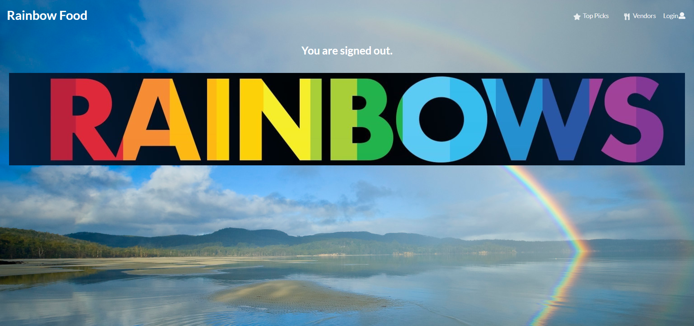

# Table of contents

* [About Rainbow Food](#about-rainbow-food)
* [User Guide](#user-guide)
* [Developer Guide](#developer-guide)
* [Development History](#development-history)
* [Meet the Team](#meet-the-team)

# About Rainbow Food
Rainbow Food is an application that can help students what food they want on any given day at the University of Hawaii at Manoa.
This app allows you to know what food will be available today and what is the top picks at campus, and it also provide the locations.
The best thing of this app is that you can give a rate of food that you like.

# Links

Application: [Application](http://rainbowfood.meteorapp.com/#/) <br>
View Project on GitHub: [View Project on GitHub](https://github.com/rainbow-food/rainbow-food) <br>
Project Board M1: [Project Board M1](https://github.com/rainbow-food/rainbow-food/projects/1) <br>
Project Board M2: [Project Board M2](https://github.com/rainbow-food/rainbow-food/projects/2)<br>
Project Board M3: [Project Board M3](https://github.com/rainbow-food/rainbow-food/projects/3)


# User Guide
#### Landing Page
When deploying the Rainbow Food application, users will go to the page. The landing page informs users what Rainbow Food application is all about.


#### Sign Up Page
This page will allow user to make their account to use this application.


#### Sign In Page
User can login with their account.


#### Sign Out Page
User can know they sign out successfully.


#### User Profile
User can provide their personal information about themselves.


#### Top Picks
This provide the most popular meals of the day.


#### Food Available
This provides what food vendors are offer.


#### Vendors
User can easily view the vendor's hours of operation and location on campus.

#### Add Vendor
Vendors can sign up and edit their information, which help user know where they are and available time of the day.


# Developer Guide
This section will walk you through the steps to get the project running locally.

## Installation

[Install Meteor](https://www.meteor.com/install)

Clone this GitHub repo to your local computer. *You may need to request access.*
```bash
$ git clone https://github.com/rainbow-food/rainbow-food
```

cd into the `app/` directory
```bash
$ cd rainbow-food/app/
```

Install package dependencies
```bash
$ meteor npm install
```

Start the application
```bash
$ meteor npm run start
```

If all goes well, your command line output should look like this.

```bash
$ meteor npm run start

>  meteor-application-template-react@ start C:\Users\Owner\Desktop\ICS 314\Final Project\rainbow-food\app
> meteor --no-release-check --settings ../config/settings.development.json

[[[[[ C:\Users\Owner\Desktop\ICS 314\Final Project\rainbow-food\app]]]]]

=> Started proxy.
=> Started MongoDB.
W20181113-15:53:57.781(-10)? (STDERR) Note: you are using a pure-JavaScript implementation of bcrypt.
W20181113-15:53:58.269(-10)? (STDERR) While this implementation will work correctly, it is known to be
W20181113-15:53:58.269(-10)? (STDERR) approximately three times slower than the native implementation.
W20181113-15:53:58.270(-10)? (STDERR) In order to use the native implementation instead, run
W20181113-15:53:58.270(-10)? (STDERR)
W20181113-15:53:58.270(-10)? (STDERR)   meteor npm install --save bcrypt
W20181113-15:53:58.271(-10)? (STDERR)
W20181113-15:53:58.271(-10)? (STDERR) in the root directory of your application.
I20181113-15:53:58.271(-10)? Creating the default user(s)
I20181113-15:53:58.272(-10)?   Creating user admin@foo.com.
I20181113-15:53:58.272(-10)?   Creating user john@foo.com.
I20181113-15:53:58.272(-10)? Creating default data.
I20181113-15:53:58.273(-10)?   Adding: Basket (john@foo.com)
I20181113-15:53:58.273(-10)?   Adding: Bicycle (john@foo.com)
I20181113-15:53:58.275(-10)?   Adding: Banana (admin@foo.com)
I20181113-15:53:58.276(-10)?   Adding: Boogie Board (admin@foo.com)
=> Started your app.

=> App running at: http://localhost:3000/
   Type Control-C twice to stop.
```

**Warning Message:** You may get a warning like this.

```bash
W20180425-00:19:45.533(-10)? (STDERR) Note: you are using a pure-JavaScript implementation of bcrypt.
W20180425-00:19:45.534(-10)? (STDERR) While this implementation will work correctly, it is known to be
W20180425-00:19:45.534(-10)? (STDERR) approximately three times slower than the native implementation.
W20180425-00:19:45.534(-10)? (STDERR) In order to use the native implementation instead, run
W20180425-00:19:45.534(-10)? (STDERR)
W20180425-00:19:45.534(-10)? (STDERR)   meteor npm install --save bcrypt
W20180425-00:19:45.535(-10)? (STDERR)
W20180425-00:19:45.535(-10)? (STDERR) in the root directory of your application.
```

*Bcrypt* is not used in this application in order to maintain cross-platform compatibility. It is non-trivial to install *Bcrypt* on Windows and the impact of omitting it on small applications such as this is negligable. The warning can be safely ignored.

Once running, you can view the application at [http://localhost:3000.](http://localhost:3000)

# Development History

Progress on the Simply Delish is divided into four milestones. Each milestone is a progression in the development process.

## Milestone 1: Create Visual Mockups for Pages
The goal of this milestone was to determine the general direction of the project as well as determine what pages are needed and how they will all interact with each other at an abstract level.

### Mockup Screenshots
#### Landing Page

#### User Profile


### Milestone 2
### Mockup Screenshots
#### Top Picks Page

#### Food Available Page


### Milestone 3
### Landing Page

### Add Profile 

### Profile

### Edit Profile

### List Profile

### Add Vendor


# Meet the Team
- [Yu Ting Hsu](https://yuting7.github.io)
- [Jonathan Oba](https://jonathanoba.github.io)
- [Tyler Asato](https://tylerz1443.github.io)
